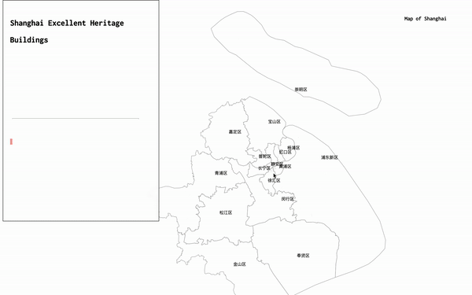

Shanghai Excellent Heritage Buildings Visualized
====
by Alan Lecheng chao

[Link to Current Version](https://alanlechengchao.github.io/cdv-student/projects/data-story/)



This is a project the geographic allocation of the heritage buildings in Shanghai. Through this process, the rawness of the data is intentionally reviewed. Users will be able to dig into details in their own exploration of the project.

## Data Sources and Compilation

One Important Aspect of this project is a cross-reference between multiple datasets. That includes
- [Dataset from the Shanghai Government](http://fgj.sh.gov.cn/yxlsjzcs/20200414/b9946bf8508e4b9689671fcd4146bb86.html)

- [A Third-Party Dataset provided by Tongji University](http://www.heritage-architectures.com/)

However the dataset provided does not have a coordinate so that the location could be visualized. Hence, I utilized the **geocoding** process.

[A third-party geocoding website](http://www.giscalculator.com/coordtransform/) helped me so that I would not be struggling at purchasing an API key for that.

Each Datapoint is measured by a serial number that looks like this. And by the end, I used a python file to iterate every datapoint and inserted the coordinates based on the serial number. Along with the HTML content that is scraped from [this website](http://www.heritage-architectures.com/).

```json
{
  "number": "5A001",
  "previousName": "新康大楼",
  "currentName": "新康大楼",
  "address": "江西中路260号",
  "date": "1930",
  "null": ["四", "", "", ""],
  "coordinates": [121.486873, 31.237374],
  "website": "SOME HTML STRING FILE"
}
```

## Process
Essentially, a geographic illustration of datasets like this provides intuitive feedback for people. The style imitates people's usual imagination of data, using monospace fonts and simplified color pallete, that I intentially want to reveal the rawness of data collect, and thinks about our relationship with the raw data entries.

For the program structure, the iteractions are initiated by constantly zooming the map. Here, I utilized a [finite state machine](https://brilliant.org/wiki/finite-state-machines/) mechanism. Whenever the user reached the bottom of the zooming periods and zoomed out, the next state will be rendered. However, the code blocks exceeds the regular use of d3.js. Also, if time permits, I would be putting up a street-detailed map of Shanghai in visible ```.geojson``` file. Sadly, the max effort of mine is to produce an ```.svg```

